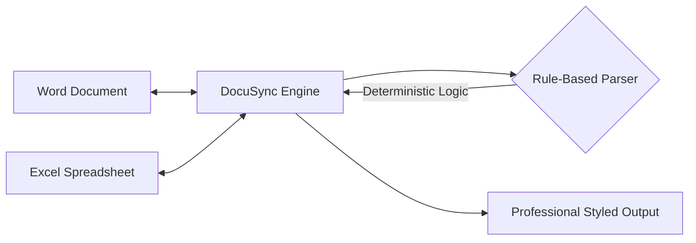

# DocuSync (Corporate Edition)

### 100% Deterministic Bidirectional Word/Excel Transformation Engine

DocuSync is a professional-grade tool designed for high-security corporate environments. It enables seamless transformation between unstructured Word documents and structured Excel workbooks using high-precision, rule-based logic while preserving semantic meaning, accuracy, and a consistent visual identity.

---

## Key Features

- **Deterministic Precision**: Uses high-fidelity regex and pattern-matching logic to identify findings, actions, and metadata.
- **Localized Processing**: All operations are performed locally on-instance with zero external dependencies. All processing is rule-driven.
- **Narrative to Structure**: Automatically extracts data from Word documents and maps them into filterable, styled Excel workbooks.
- **Structure to Narrative**: Reconstructs coherent professional reports from spreadsheet datasets using structured templates.
- **Consistent Visuals**: All outputs strictly adhere to a standardized orange and white palette with professional formatting.

---

## Architecture



- **Backend**: FastAPI (Python), python-docx, openpyxl, pandas.
- **Frontend**: Next.js 14 (TypeScript), Tailwind CSS (Orange Theme), lucide-react.

---

## Installation and Setup

### 1. Requirements
- Docker and Docker Compose

### 2. Launching DocuSync
Navigate to the infra/ directory and run:
```bash
docker-compose up --build
```

- **Frontend**: http://localhost:3000
- **Backend API**: http://localhost:8000/api/v1

---

## Visual Identity
DocuSync follows a strict design system:
- **Primary Orange**: #FF6200
- **Background White**: #FFFFFF
- **Typography**: Inter (Modern Sans-serif)
- **Excel Styles**: Orange headers, zebra-striped rows, conditional status coloring (Orange for OPEN, Emerald for CLOSED).

---
**Developed by DocuSync Engineering - Operational Integrity**
